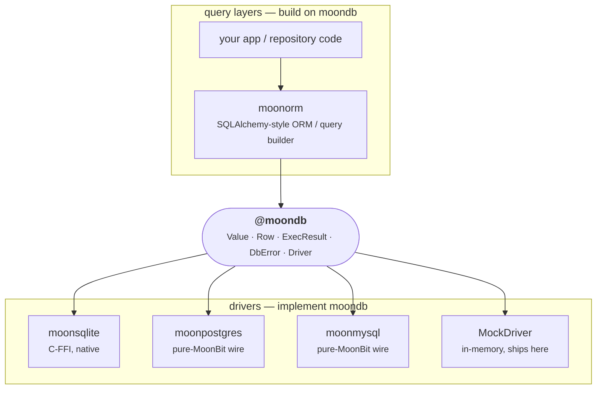

<div align="center">

# moondb

**The standard database-access interface for [MoonBit](https://www.moonbitlang.com/).**

The small, pure contract that sits between database *drivers* and query *layers* — MoonBit's answer to Go's [`database/sql/driver`](https://pkg.go.dev/database/sql/driver) and Python's [DB-API 2.0 (PEP 249)](https://peps.python.org/pep-0249/).

[](https://github.com/moonbitstack/moonorm/actions)
[](#tests)
[](https://moonbitstack.github.io/moonorm/db/)
[](https://mooncakes.io/docs/moonbitstack/moondb)
[](LICENSE)

</div>

> Moved on mooncakes from `Lfan-ke/moondb` to `moonbitstack/moondb`.

`moondb` defines **one thing**: the boundary every SQL database backend implements and every ORM / query builder is written against. It has **zero dependencies**, is **pure** (compiles on wasm, wasm-gc, js, and native alike), and ships a dependency-free reference driver so the whole stack above it can be tested without a database.

It deliberately does *not* connect to a database, speak a wire protocol, or build SQL. Those belong on either side of the seam:



The value of a contract package is that the two sides are written by different people at different times and still fit: a driver author implements [`Driver`](#driver) once, and *every* query layer works against their backend; an ORM author targets `Driver` once, and *every* driver works under their ORM.

## Install

```bash
moon add moonbitstack/moondb
```

## The interface at a glance

| Type | Role | Transliterated from |
|---|---|---|
| [`Value`](#value) | one dialect-neutral cell — the unit crossing the boundary both ways | Go `driver.Value`, DB-API type objects |
| [`Row`](#row) | one result row: aligned column names + `Value`s, with typed accessors | `sql.Rows` / DB-API row tuple |
| [`ExecResult`](#execresult) | outcome of a non-query: rows affected + last insert id | Go `sql.Result`, DB-API `rowcount`/`lastrowid` |
| [`DbError`](#dberror) | the one error every operation raises | DB-API exception hierarchy (flattened) |
| [`Driver`](#driver) | the trait a backend implements / a query layer targets (with a default `ping` health probe) | Go `driver.Conn`+`Execer`+`Queryer`+`Pinger` |
| [`Pool`](#pool) | a fixed-ceiling connection pool over any `Driver` | Go `sql.DB` pool, SQLAlchemy `QueuePool` |
| [`AsyncDriver`](#asyncdriver) | the same contract for a backend reached over a socket, every method awaited | asyncpg / `asyncio` DB-API |
| [`AsyncCursor`](#asyncdriver) | forward-only cursor whose `next` is awaited, for a wire driver's live rows | — |
| [`MockDriver`](#mockdriver) | dependency-free in-memory reference driver, for tests | — |

### The binding contract

`execute` and `query` both take `(sql, params)`. The SQL string carries **positional placeholders** and `params` supplies one `Value` per placeholder, **in order**. Values are bound out-of-band by the driver and are **never** spliced into the SQL text — that is what makes a moondb-based stack injection-safe all the way to the wire.

The placeholder *token* is the driver's dialect (`?` for SQLite/MySQL, `$1`, `$2`, … for PostgreSQL); moondb fixes the *calling convention* — an ordered `Array[Value]` — not the spelling.

## Quickstart

```moonbit
test "round-trip through the interface" {
  // A query layer is written against the `Driver` trait, not a concrete backend.
  let db = @moondb.MockDriver::new()

  // Bind values as parameters — never string-interpolated into the SQL.
  db.execute("INSERT INTO hero (id, name) VALUES (?, ?)", [Int(1), Text("Nova")])
  |> ignore

  db.begin()
  db.execute("INSERT INTO hero (id, name) VALUES (?, ?)", [Int(2), Text("Iris")])
  |> ignore
  db.rollback() // Iris is undone; Nova remains.

  let rows = db.query("SELECT id, name FROM hero", [])
  assert_eq(rows.length(), 1)
  assert_eq(rows[0].int_by("c0"), 1)
  assert_eq(rows[0].text_by("c1"), "Nova")
}
```

Swap `MockDriver` for `moonsqlite` / `moonpostgres` / `moonmysql` and the same code runs against a real database — that substitutability *is* the point of the package.

## Implementing a driver

A backend implements the six-method `Driver` trait. `DbError` is `pub(all)`, so a driver in its own package can construct and raise every case:

```moonbit
pub impl @moondb.Driver for MyConn with execute(self, sql, params) {
  // ... bind `params` positionally, run `sql`, then:
  { rows_affected: n, last_insert_id: id }
}
// query / begin / commit / rollback / close likewise.
```

`execute`/`query`/`begin`/`commit`/`rollback` raise `DbError` on failure; `close` is best-effort and idempotent.

## Design notes

- **Why raise, not `Result`.** Typed accessors and driver calls `raise DbError` rather than returning `Result[_, DbError]`, so a decode bug or a dropped connection surfaces at the call site instead of being silently swallowed. A caller opts into recovery with `try`/`catch`.
- **Typed accessors are strict.** `row.int(i)` raises `TypeError` if the cell is not an integer — including when it is `NULL`. Guard nullable columns with `is_null` first. Integer→integer and integer→double conversions are allowed and lossless; `int` narrows an `Int64` and says so.
- **`DbError` is `pub(all)`.** A plain `pub suberror` can be *caught* from another package but not *constructed* — which would stop out-of-tree drivers from raising it. `pub(all)` opens the constructors.
- **There are two driver traits, on purpose.** `Driver` is synchronous, which is right for a backend whose calls block in C (moonsqlite steps a prepared statement and returns). A backend reached over TCP cannot be written that way: MoonBit's only socket stack is async-only, and an `async fn` cannot be called from a synchronous one. A wire driver forced to conform to `Driver` can do nothing but raise from every method — and because `ping` is a *defaulted* method built on `query`, it swallows that raise into `false`, so a `Pool` with `pre_ping` judges every one of its connections permanently unhealthy. `AsyncDriver` is the seam for those backends: the same eight operations, each awaited. It is a peer of `Driver`, not a replacement — a synchronous backend keeps implementing `Driver` and never becomes async. Declaring async methods pulls in no async runtime, so moondb stays dependency-free and still compiles on every backend; only a driver that implements the trait, and a caller that runs it in an event loop, need one.

- **The pool is synchronous.** `Pool[D]` reuses idle connections under a size ceiling, evicts a connection that fails its `pre_ping` probe or outlives `max_lifetime` (age measured by an injected `clock`, the way `database/sql` swaps `nowFunc` in tests), and offers a non-blocking `try_acquire`. Because moondb's base contract is sync and the pure backends have no threads, an exhausted `acquire` fails immediately rather than blocking — the `acquire_timeout` is the budget an async driver layers real waiting on top of. `ping` is a default `Driver` method (`SELECT 1`), so every driver gets a health probe for free.

## Roadmap

v0.1 fixes the smallest contract that a relational backend and a query layer both need, so it can stabilise. Planned, additive extensions (none of which change the v0.1 surface):

- **Prepared statements** — a `Stmt` handle for repeated execution with rebinding.
- **Streaming rows** — a `Rows` cursor so large result sets need not fully materialise.
- **A temporal `Value` case** — dates/times currently ride as ISO-8601 `Text`; a dedicated case (with a decided epoch/precision) will follow.
- **Named parameters** and **nested transactions (savepoints)** as a layer over the flat `begin`/`commit`/`rollback`.

## Tests

The suite covers the value model, every typed accessor and its error path, the error type, the reference driver — including real transaction rollback/commit semantics — and the connection pool. Key behaviours are mutation-verified: breaking `rollback` turns the transaction tests red, and disabling the pool's `pre_ping` eviction or its `max_lifetime` retirement turns the corresponding pool tests red. They run on all four backends:

```bash
moon test --target all
```

## License

Apache-2.0 © Leo Cheng
