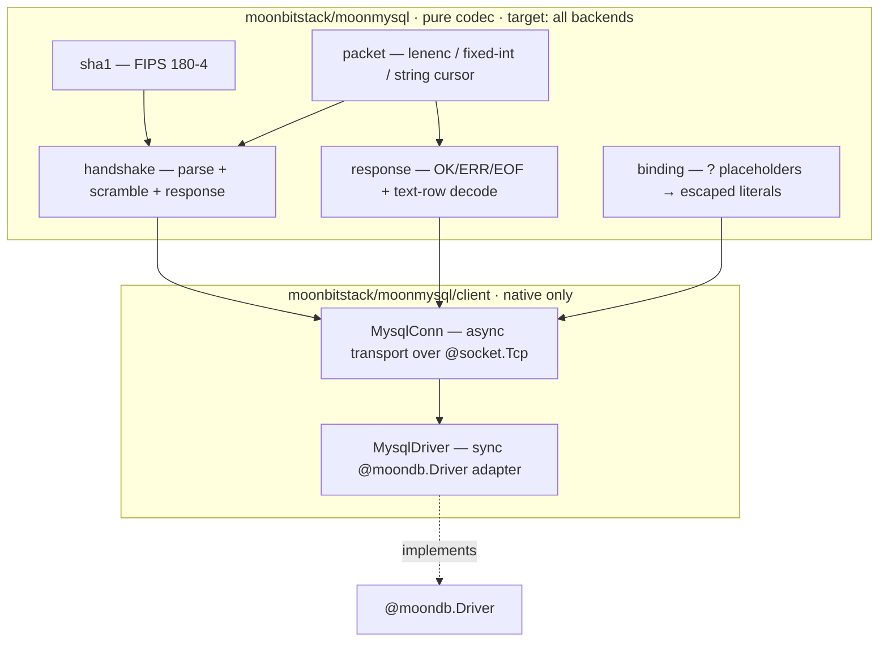

# moonmysql

> Moved on mooncakes from `moonbitstack/moonmysql` to `moonbitstack/moonmysql`.

A **pure-MoonBit MySQL / MariaDB wire-protocol driver** — no C, no bindings, like
PyMySQL. It speaks the MySQL client/server protocol (version 10 handshake,
`mysql_native_password` auth, the text `COM_QUERY` protocol) directly over a raw
TCP socket, and implements the [`@moondb.Driver`](https://github.com/moonbitstack/moonorm/tree/master/db)
contract so a moondb-based query layer (moonorm) can talk to MySQL through the
same seam as the SQLite and Postgres drivers.

**MariaDB** speaks the same wire protocol and is a first-class target: the
handshake parser recognises MariaDB's `5.5.5-` version sentinel (recovering the
real version and reporting `server_kind = MariaDB`), reads past its extended
capability bits without disturbing the MySQL-8 offsets, and authenticates over
the shared `mysql_native_password` path. CI runs the *same* integration suite
against MySQL 8, MariaDB 11, and MariaDB 10.11.

```
$ moon add moonbitstack/moonmysql
```

Previously published as `Lfan-ke/moon-mysql`.

- **API reference:** https://moonbitstack.github.io/moonorm/mysql/
- **License:** Apache-2.0

## Quickstart

The synchronous `@moondb.Driver` adapter is the one-call-per-statement surface:

```moonbit
let db = @client.MysqlDriver::new(
  user="root", password="root", database="test",
  host="127.0.0.1", port=3306,
)
db.execute("CREATE TABLE t (id INT PRIMARY KEY, name TEXT)", [])
db.execute("INSERT INTO t VALUES (?, ?)", [@moondb.Int(1), @moondb.Text("a")])
let rows = db.query("SELECT id, name FROM t", [])
rows[0].int_by("id")   // => 1
rows[0].text_by("name") // => "a"
```

For long-lived connections and real transactions, use the asynchronous
`MysqlConn` directly (see [The async wall](#the-async-wall) below):

```moonbit
async fn run() -> Unit raise {
  let conn = @client.MysqlConn::connect("127.0.0.1", 3306, "root", "root", "test")
  conn.begin()
  conn.execute("INSERT INTO t VALUES (?, ?)", [@moondb.Int(2), @moondb.Text("b")])
  conn.commit()
  let rows = conn.query("SELECT * FROM t", [])
  conn.close()
}
```

## Architecture

The library is split so the entire wire format is testable off any backend, and
only the socket transport is native-bound.



```
%% root (pure, all backends)          client (native)
%%   sha1 ─┐                            MysqlConn ── async socket transport
%%   packet┼─ handshake ─┐                 │
%%         └─ response ──┼──────────────►  │
%%            binding ───┘              MysqlDriver ── impl @moondb.Driver
```

Every packet field type — the 3-byte length + sequence-id framing, length-encoded
and fixed-width little-endian integers, NUL- and length-encoded strings — is
parsed through an in-memory cursor in the pure half, so the codec is unit-tested
on wasm, wasm-gc, js, and native. The `client` package adds the async socket
transport and the driver, and is native-only because `moonbitlang/async/socket`
has no JS/wasm backend.

## The async wall

`moonbitlang/async` sockets are asynchronous, but `@moondb.Driver`'s methods are
synchronous, and MoonBit forbids calling an `async` function from a non-`async`
one. The synchronous adapter bridges each call through `@async.run_async_main`,
which runs an async body to completion on a fresh event loop.

A socket does **not** survive across two such event loops (each tears its file
descriptors down — verified empirically), so the synchronous `MysqlDriver` opens
a fresh connection, authenticates, runs one statement, and closes, on every
`execute`/`query`. This is correct and efficient enough for autocommit work
(which is exactly what a moondb roundtrip is), but it means a transaction cannot
be held open across separate `Driver` calls. `begin`/`commit`/`rollback` on the
synchronous adapter therefore raise a clear `DbError` directing you to the
asynchronous `MysqlConn`, which owns its socket for its whole lifetime and
brackets real server-side transactions. This is a language constraint, not a
shortcut.

## Injection safety

Values never reach the server as SQL text unescaped. The text protocol has no
out-of-band parameter binding (that arrives with prepared statements — see the
roadmap), so this round renders each bound `@moondb.Value` as an escaped SQL
literal: strings are single-quoted with every metacharacter backslash-escaped,
blobs use the `x'…'` hex form, and the placeholder scanner tracks single-,
double-, and backtick-quoted spans so a literal `?` inside a string is never
mistaken for a placeholder.

## Type mapping (text protocol)

| MySQL column type | `@moondb.Value` |
|---|---|
| `TINYINT` / `SMALLINT` / `INT` / `MEDIUMINT` / `YEAR` | `Int` |
| `BIGINT` | `Int64` |
| `FLOAT` / `DOUBLE` | `Double` |
| `binary`-collation columns (`BLOB`, `VARBINARY`, …) | `Blob` |
| `VARCHAR` / `TEXT` / `DECIMAL` / `JSON` / temporal (ISO text) | `Text` |
| SQL `NULL` | `Null` |

## Tested against a real MySQL and MariaDB

CI (`.github/workflows/ci.yml`) starts a real **MySQL 8** (pinned to
`mysql_native_password`) and, in separate jobs, **MariaDB 11** and **MariaDB
10.11**, then runs `moon check`/`build`/`test` on native against each. The one
integration test — gated by `MYSQL_TEST` so a local `moon test` without a
database skips it — connects, authenticates, creates a table, inserts
parameter-bound rows (integers, UTF-8 text, an embedded quote), and asserts the
decoded result set cell by cell; the same suite is green on all three servers.
The pure codec additionally runs on every backend, and `parse_server_version`
has a unit test covering both MariaDB's `5.5.5-` sentinel and a plain MySQL
version string.

### MariaDB auth negotiation

`mysql_native_password` is the tested path on both servers. If a server's default
plugin differs but it still offers pluggable auth, the client advertises
`mysql_native_password` and answers the server's `AuthSwitchRequest` for it — the
down-negotiation MariaDB may require. A switch to any other plugin, or a
`caching_sha2_password` full-auth exchange, raises a clear `UnsupportedError`
pointing here rather than silently mis-authenticating.

## Roadmap

This round covers connect + `mysql_native_password` auth + the text protocol +
value decode + the `@moondb.Driver` adapter + a real roundtrip. Planned next:

- **Prepared statements** — `COM_STMT_PREPARE`/`COM_STMT_EXECUTE`, the binary
  protocol, and true out-of-band parameter binding.
- **`caching_sha2_password`** — MySQL 8's default plugin, including the RSA
  full-auth exchange over a plain connection.
- **`client_ed25519`** — MariaDB's native Ed25519 auth plugin, for MariaDB
  accounts not using `mysql_native_password`.
- **Full type coverage** — binary-protocol temporal/decimal/bit decoding, and a
  dedicated temporal `Value` case once moondb grows one.
- **Connection pooling** and a streaming `Rows` cursor.
- **TLS** once `moonbitlang/async` exposes a client-side entry point.

## Parameter binding

The text protocol has no out-of-band binding, so `bind_params` renders each value as
an escaped literal. That makes the escaping load-bearing rather than cosmetic: a
connection asks the server for `@@sql_mode` and `@@character_set_connection` at
connect time and escapes for what it finds — a doubled quote under
`NO_BACKSLASH_ESCAPES`, a backslash otherwise. A charset whose characters can end in
`0x5C` (gbk, big5, sjis, cp932, gb18030) cannot be escaped safely with backslashes at
all, so such a connection is refused rather than served.

Prepared statements (`COM_STMT_PREPARE` + the binary protocol) are what remove the
question entirely, and are the next thing this driver needs.
