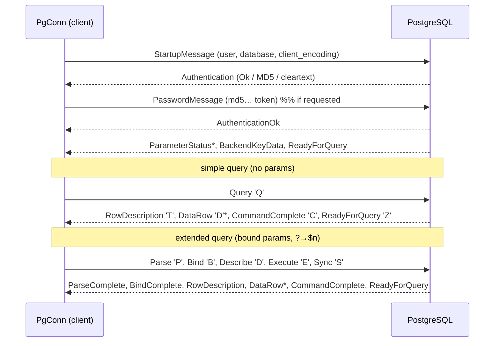

# moonpostgres

A **pure-MoonBit PostgreSQL driver** — the v3 frontend/backend wire protocol spoken directly over async TCP, with **zero C** and no `libpq`. Like [asyncpg](https://github.com/MagicStack/asyncpg) or [pg8000](https://github.com/tlocke/pg8000), it talks to a real PostgreSQL server itself. `PgConn` implements the [`@moondb.AsyncDriver`](https://mooncakes.io/docs/Lfan-ke/moondb) contract, so a moondb-based stack (e.g. `moonorm`) can sit on top of it.

```
moon add Lfan-ke/moonpostgres
```

Previously published as `Lfan-ke/moon-postgres`.

Native-only: the connection layer rides `moonbitlang/async` sockets, which have no JS/wasm backend.

## Quickstart

The real driver is the async `PgConn` (asyncpg-shaped), used inside an event loop (`async fn main` / `async test`):

```moonbit
async fn run() -> Unit raise {
  let conn = @moonpostgres.PgConn::connect(
    "127.0.0.1", 5432, "postgres", "postgres", "test",
  )
  conn.execute("CREATE TABLE hero (id int, name text)", []) |> ignore

  // '?' placeholders are translated to '$1','$2' and bound out-of-band
  // (never spliced into the SQL) — injection-safe to the wire.
  conn.execute("INSERT INTO hero VALUES (?, ?)", [
    @moondb.Int(1), @moondb.Text("Boromir"),
  ]) |> ignore

  let rows = conn.query("SELECT id, name FROM hero WHERE id = ?", [@moondb.Int(1)])
  println(rows[0].text_by("name")) // Boromir

  conn.begin()
  conn.execute("UPDATE hero SET name = ? WHERE id = ?", [
    @moondb.Text("Faramir"), @moondb.Int(1),
  ]) |> ignore
  conn.commit()

  conn.close()
}
```

## What it speaks



- **Framing** — every message is a 1-byte type tag, a big-endian `Int32` self-inclusive length, and a payload (the untagged StartupMessage aside).
- **Auth** — `AuthenticationOk` (trust), cleartext, and **MD5** (`md5(md5(password+user)+salt)`, with a self-contained pure-MoonBit MD5). SCRAM-SHA-256 is on the roadmap.
- **Simple query** (`Q`) when there are no parameters; **extended query** (`Parse`/`Bind`/`Describe`/`Execute`/`Sync`) when there are, with `?`→`$n` translation and out-of-band **text-format** binding.
- **Decoding** — `RowDescription` + `DataRow` decode into `@moondb.Row`; column type OIDs map `int2`/`int4`→`Int`, `int8`→`Int64`, `float4`/`float8`→`Double`, `bool`→`Bool`, `bytea`→`Blob`, everything else→`Text`.

## Why the driver is async

`@moondb.Driver`'s methods are **synchronous** (`fn execute(...) raise DbError`), which fits an FFI-backed driver like `moonsqlite` whose C calls block. PostgreSQL is reached over TCP, and MoonBit's only socket stack (`moonbitlang/async`) is **async-only**: an `async fn` cannot be called from a synchronous one, and the runtime exposes no public "run this async thunk to completion" bridge (`with_event_loop` lives in an import-blocked `internal` package). A synchronous method therefore cannot perform a PostgreSQL round trip.

That is why moondb has a second seam. **`PgConn` implements [`@moondb.AsyncDriver`]** — the same eight operations as `Driver`, every one of them awaited — and `PgDriver` is now just the connection descriptor you open one from. Use it inside an event loop (`async test` / `async fn main`):

```moonbit
async fn main {
  let conn = PgDriver::new(host="127.0.0.1", user="postgres", database="app").connect()
  defer conn.close()
  let drv : &@moondb.AsyncDriver = conn
  let rows = drv.query("SELECT id, name FROM users WHERE id = ?", [@moondb.Int(1)])
}
```

Before this, `PgDriver` implemented the *synchronous* `Driver` by raising from every row-touching method. That was worse than useless in one specific way: `ping` is a defaulted method built on `query`, so it swallowed the raise and returned `false`, and any `Pool` with `pre_ping` judged every connection permanently unhealthy. The raising façade is gone.

This is the language-idiomatic equivalent, not a shortcut: asyncpg is async for exactly the same reason.

## Testing

- **Unit** (`moon test`) — MD5 vectors, `?`→`$n` translation (literals/identifiers/comments/dollar-quotes/`??`), value encode/decode by OID, and message framing + `RowDescription`/`DataRow` decode against synthetic backend messages.
- **Integration** (`moon test`, gated on `MOON_PG_TEST`) — connect / DDL / parameterised INSERT / SELECT round trip and transaction commit+rollback against a **real PostgreSQL**. Skipped when `MOON_PG_TEST` is unset (local checkout without a database); CI stands up a `postgres:16` service and runs it. Connection parameters come from the standard `PGHOST`/`PGPORT`/`PGUSER`/`PGPASSWORD`/`PGDATABASE` variables.

The `DataRow` decoder is mutation-checked: breaking it makes the decode test fail with a type error.

## Roadmap

This round covers connect + auth (MD5/trust) + simple query + text decode + `?`→`$n` + `@moondb.AsyncDriver` conformance + a real round trip. Later rounds:

- **SCRAM-SHA-256** authentication (the default for PostgreSQL 14+ with a password set).
- **Binary result/parameter format** and a **type-OID registry** (numeric, dates/times, arrays, JSON, UUID).
- **Prepared statements** (named, cached) and a streaming `Rows` cursor.
- **`RETURNING`**-based `last_insert_id`, `COPY`, `LISTEN`/`NOTIFY`, TLS, and a connection pool.

## License

Apache-2.0 © Leo Cheng.
